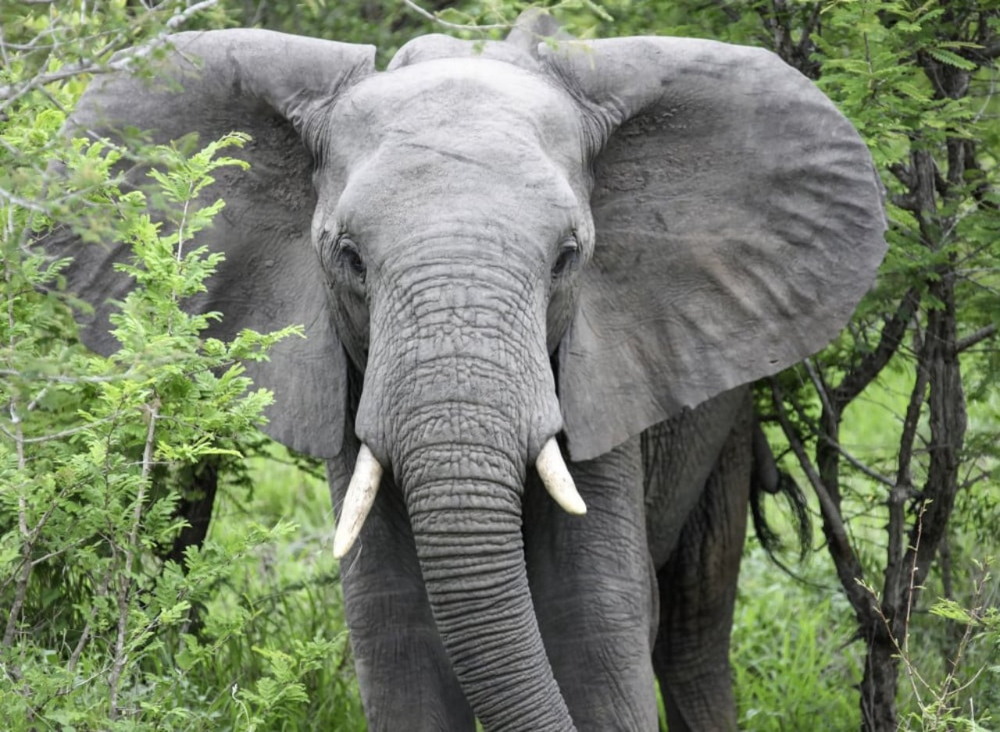
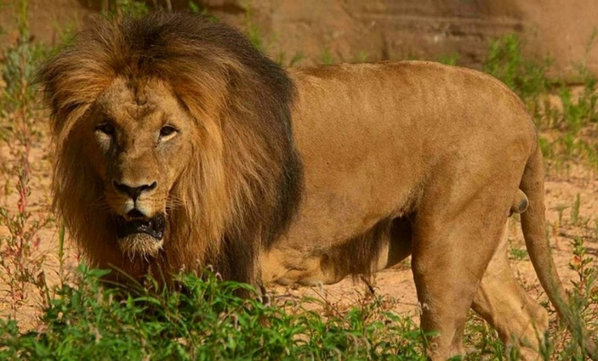
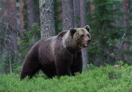
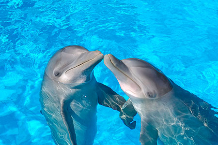
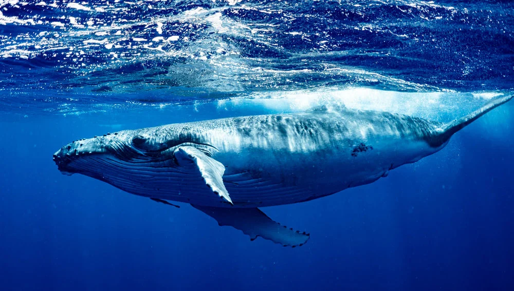
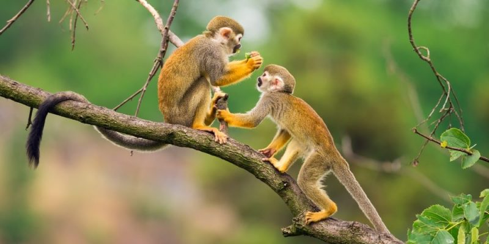
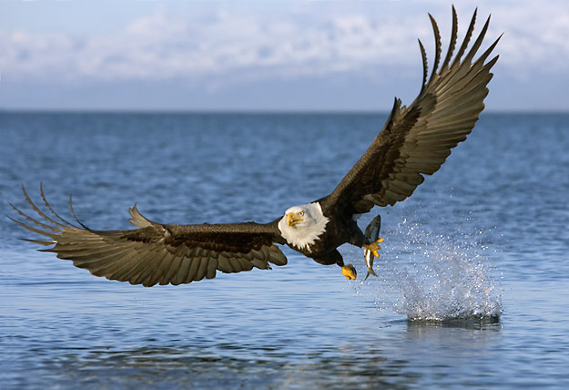
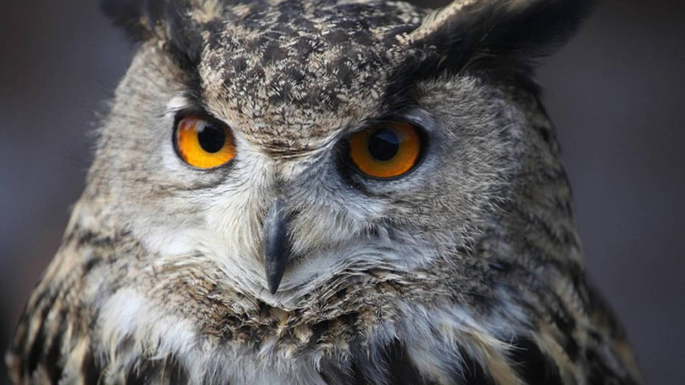

# ANIMALES-DEL-MUNDO
<!DOCTYPE html>
<html lang="es">
<head>
  <meta charset="UTF-8">
  <meta name="viewport" content="width=device-width, initial-scale=1.0">
  <title>Animales del Mundo</title>
  <!-- Bootstrap CSS -->
  <link href="https://cdn.jsdelivr.net/npm/bootstrap@5.3.0/dist/css/bootstrap.min.css" rel="stylesheet">
  <!-- Custom CSS -->
  
</head>
<body>
  <header>
    <nav class="navbar navbar-expand-md navbar-dark bg-primary">
      

        <a class="navbar-brand" href="#">Animales del Mundo</a>
        <button class="navbar-toggler" type="button" data-bs-toggle="collapse" data-bs-target="#navbarNav" aria-controls="navbarNav" aria-expanded="false" aria-label="Toggle navigation">
          
        </button>
        

          <ul class="navbar-nav ms-auto">
            <li class="nav-item">
              <a class="nav-link" href="#terrestres">Terrestres</a>
            </li>
            <li class="nav-item">
              <a class="nav-link" href="#acuaticos">Acuáticos</a>
            </li>
            <li class="nav-item">
              <a class="nav-link" href="#mamiferos">Mamíferos</a>
            </li>
            <li class="nav-item">
              <a class="nav-link" href="#aereos">Aéreos</a>
            </li>
          </ul>
        

      

    </nav>
  </header>

  <main class="container py-4">
    <section id="terrestres">
      <h2 class="mb-4">Animales Terrestres</h2>
      

        

          

            
            

              <h5 class="card-title">Elefante</h5>
              
Los elefantes son los mamíferos terrestres más grandes y herbívoros.

            

          

        

        

          

            
            

              <h5 class="card-title">León</h5>
              
El león es el rey de la selva y un poderoso depredador.

            

          

        

        

          

            
            

              <h5 class="card-title">Oso</h5>
              
Los osos son grandes mamíferos omnívoros que viven en diversas regiones del mundo.

            

          

        

      

    </section>

    <section id="acuaticos" class="mt-5">
      <h2 class="mb-4">Animales Acuáticos</h2>
      

        

          

            
            

              <h5 class="card-title">Delfín</h5>
              
Los delfines son mamíferos marinos conocidos por su inteligencia y comportamiento juguetón.

            

          

        

        

          

            
            

              <h5 class="card-title">Tiburón</h5>
              
Los tiburones son peces cartilaginosos que ocupan un lugar destacado en el ecosistema marino.

            

          

        

        

          

            
            

              <h5 class="card-title">Ballena</h5>
              
Las ballenas son mamíferos marinos enormes y algunos de los animales más grandes del planeta.

            

          

        

      

    </section>

    <section id="mamiferos" class="mt-5">
      <h2 class="mb-4">Mamíferos</h2>
      

        

          

            
            

              <h5 class="card-title">Gato</h5>
              
Los gatos son felinos domésticos apreciados por su independencia y habilidades cazadoras.

            

          

        

        

          

            
            

              <h5 class="card-title">Perro</h5>
              
Los perros son conocidos por ser leales compañeros de los humanos y por su variedad de razas y tamaños.

            

          

        

        

          

            
            

              <h5 class="card-title">Mono</h5>
              
Los monos son primates muy inteligentes y sociales, que se encuentran en diversas partes del mundo.

            

          

        

      

    </section>

    <section id="aereos" class="mt-5">
      <h2 class="mb-4">Animales Aéreos</h2>
      

        

          

            
            

              <h5 class="card-title">Águila</h5>
              
Las águilas son aves rapaces conocidas por su agudeza visual y habilidades de caza.

            

          

        

        

          

            
            

              <h5 class="card-title">Colibrí</h5>
              
Los colibríes son las aves más pequeñas y tienen un vuelo rápido y ágil.

            

          

        

        

          

            
            

              <h5 class="card-title">Búho</h5>
              
Los búhos son aves nocturnas que están asociadas con la sabiduría y la inteligencia en muchas culturas.</
